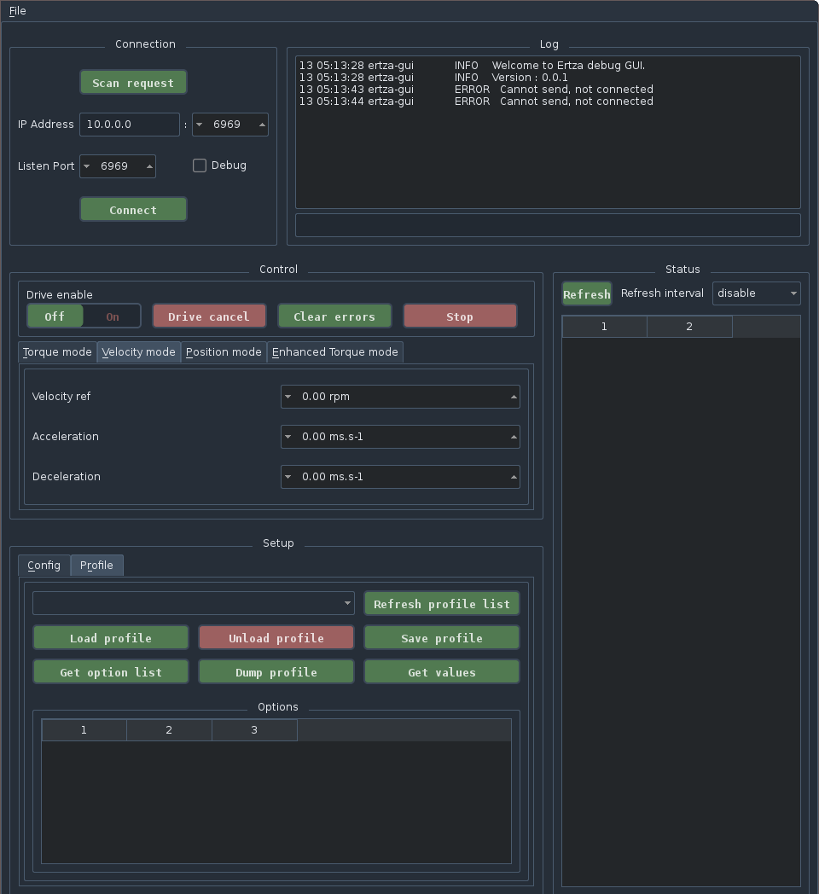

Ertza tools
===============

To help configuration and debugging, the following tools are included under `/tools`:code:

Ertza GUI
---------

Ertza GUI provides a GUI that allow to configure and control a motor block running ertza.

It has been tested under Debian but as been developed with interoperability in mind. A port under Windows or OSX shouldn't be too difficult.

It provides the following features:

* Auto detection of online motor blocks
* Instant control of motor blocks in all control modes
* Access to status data
* Configuration of motor blocks
* Profile handling system
* Remote logging of a motor block

Screenshot
^^^^^^^^^^

|ertza_gui|

